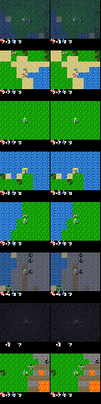

# World Model

A Dreamer-style world model for [Crafter](https://github.com/danijar/crafter): learn a compressed predictive model of the environment from pixels, then train a policy inside imagined rollouts instead of on every real interaction.

Built in PyTorch for Apple Silicon (MPS). No cloud APIs in the training or inference path — everything runs locally.

<p align="center">
  
  <br />
  <em>Real frames (left) vs autoencoder reconstructions (right).</em>
</p>

## How it works

Dreamer separates **world modeling** from **decision making**:

1. An **encoder** compresses each 64×64 RGB observation into an embedding.
2. An **RSSM** (recurrent state-space model) tracks a deterministic memory state `h` and discrete categorical latents. On real data it forms a posterior `z_posterior` from `h` and the embedding; in imagination it samples a prior `z_prior` from `h` alone.
3. A **decoder** and auxiliary heads reconstruct observations and predict reward / continuation, which train the world model.
4. An **actor-critic** acts in latent imagination — rolling the world model forward with `z_prior` only — so most learning happens without stepping the real environment.

This repo follows the DreamerV2/V3 recipe (discrete latents, straight-through gradients, unimix categorical floor, layer-normalized GRU) at a scale that fits ~24GB unified memory (e.g. 16×16 categorical latents rather than 32×32).

## What’s included

- Gymnasium wrapper for `CrafterReward-v1` / `CrafterNoReward-v1`
- Perception autoencoder with U-Net skips for sharp reconstructions
- Discrete categorical RSSM (`h`, `z_prior`, `z_posterior`, STE)
- Full world-model training: decoder + reward/continue heads, KL balancing, sequential replay
- Training configs, CLI scripts, and interactive notebooks with inline plots
- Local TensorBoard logging and mechanism diagnostics (latent entropy, occupancy, imagination drift)

Architecture notes and naming conventions live in [`PROJECT_BRIEF.md`](PROJECT_BRIEF.md). Experiment history is in [`docs/experiments.md`](docs/experiments.md).

## Requirements

- macOS on Apple Silicon (MPS)
- [Miniforge](https://github.com/conda-forge/miniforge) / conda
- Python 3.11

CUDA is not supported. Set `PYTORCH_ENABLE_MPS_FALLBACK=1` so unsupported ops fall back to CPU cleanly.

## Install

```bash
conda env create -f environment.yml
conda activate worldmodel
pip install -e ".[dev]"
export PYTORCH_ENABLE_MPS_FALLBACK=1
```

If `conda activate` fails on zsh, run `conda init zsh`, open a new shell, and try again.

Upstream `crafter` registers only with the legacy `gym` package. This repo re-registers the same env IDs for Gymnasium via `src/envs/crafter_env.py`.

Smoke-check the stack:

```bash
python scripts/verify_m0.py
pytest -q
```

## Usage

**Perception (autoencoder)**

```bash
python scripts/collect_random_frames.py
python scripts/train_autoencoder.py --config configs/m1_autoencoder.yaml
# optional fine-tune:
# python scripts/train_autoencoder.py --config configs/m1_autoencoder_finetune.yaml \
#   --resume checkpoints/m1_autoencoder_stem_rgb/ckpt_best.pt
```

**World model**

```bash
python scripts/collect_replay.py --config configs/m3_world_model.yaml
python scripts/train_world_model.py --config configs/m3_world_model.yaml
tensorboard --logdir runs   # m3/recon, m3/reward, m3/continue, m3/kl, …
```

**RSSM diagnostics**

```bash
python scripts/verify_rssm_forward.py
python scripts/visualize_rssm.py
```

**Notebooks** — reconstructions, live RSSM plots, and env checks:

```bash
python -m ipykernel install --user --name worldmodel --display-name "Python (worldmodel)"
jupyter notebook notebooks/
```

**TensorBoard**

```bash
tensorboard --logdir runs
# http://localhost:6006
```

## Layout

```
configs/       Experiment YAML
src/envs/      Crafter / MiniGrid wrappers
src/models/    Encoder, decoder, autoencoder, RSSM
src/training/  Device helpers, rollouts, diagnostics
src/agents/    Actor-critic
notebooks/     Interactive exploration (inline figures)
scripts/       CLI entry points
results/       Figures and rollouts
docs/          MkDocs source
paper/         Paper draft and figures
```

## References

- Hafner et al., [*Mastering Diverse Domains through World Models*](https://arxiv.org/abs/2301.04104) (DreamerV3)
- Hafner et al., [*Mastering Atari with Discrete World Models*](https://arxiv.org/abs/2010.02193) (DreamerV2)
- Hafner, [*Crafter*](https://danijar.com/project/crafter/)

## License

MIT
