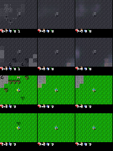
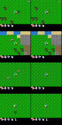

# Finding 01 — An auxiliary embed decoder is an RSSM bypass

**Status:** established (graph removed in the 2026-08-23 M3 reset)  
**Kind:** training-graph identifiability failure, not a DreamerV3 result  
**Evidence:** two weeks of M3 runs; `docs/experiments.md` postmortem; 12k-step pre-reset metrics vs 50k reset

## Claim

If the world-model graph contains **any** reconstruction path that does not go through `z_posterior`, the optimizer can drive pixel loss down while the RSSM state stays empty. The usual dashboard then *looks* like “the decoder is weak / `h` needs more capacity / we need a HUD loss,” when the information the RSSM sees is simply not what is being reconstructed.

This is not in DreamerV3. The paper’s decoder input is `feat = concat(h, z_posterior)` and nothing else.

## The two stacked bugs

### 1. `recon_embed`: encoder embedding → second decoder

A second decoder trained on the CNN embedding, **skipping the RSSM**, is a plain autoencoder sitting on the same optimizer. Embed reconstructions became recognizable (terrain, some HUD) while `[h, z_posterior]` reconstructions stayed mean-grass / one blob. Every later “loss weight” change was fighting that split:

- “`HzToMap` needs more capacity”
- “posterior should be spatial”
- “add `recon_blob` / `recon_avatar` / `recon_hud`”

Those diagnoses were locally true *given the graph*. They were the wrong graph.

### 2. `detach_weights=True` on the `[h,z]` decoder

Even the path that *did* go through the RSSM decoded through a **frozen copy** of the decoder. Gradients from `[h,z]` pixel loss could move `feat`, not the renderer. Combined with (1), the renderer trained exclusively on the bypass. Turning live weights back on *without* killing the bypass just scrambled layout: the shared upsample was being asked to paint two inconsistent targets.

A later symptom of the frozen path: solid green frames, no avatar blob. That was not posterior collapse. It was a renderer that was not allowed to learn on the RSSM path.

## What the 12k pre-reset run actually showed

At step 12000 (`results/m3`, old graph):

| metric | value | how to read it |
|---|---|---|
| `recon_l1` | ~0.032 | `[h,z]` paint still soft |
| `recon_embed_l1` | ~0.027 | bypass looks “better,” so total loss looks healthy |
| sprites / HUD digits | absent / streaks | bits never had to enter `z_posterior` |
| terrain placement | often wrong on `[h,z]` | mixing Linear + shared decoder |

*Figure. Pre-reset step 12k. If embed looks like Crafter and `[h,z]` does not, the loss is not training a world model.*

## After the reset (same environment, honest graph)

One decoder, live weights, `feat = concat(h, flatten(z_posterior))`. ~19M params (was ~131M with dual XL decoders). At 50k:

- `recon_l1` 0.326 → **0.0095**
- player, trees, HUD blocks present on the **posterior** recon
- no embed panel, because there is nothing to show

## Paper spin

**Do not frame this as “we improved DreamerV3.”** Frame it as: *faithful reimplementation surfaces an identifiability failure that extra reconstruction heads introduce.* A short appendix with the two graphs (bypass vs paper) and the embed-vs-`[h,z]` split is enough. The contribution is the failure mode, not a new architecture.

Related: finding 07 (the dashboard that made the bypass look like progress).

## Do not revive

- Any second decoder / `recon_embed` / `recon_bottleneck` / skip-to-RGB on the world-model graph.
- `detach_weights` on any path that is supposed to learn to render.
- Interpreting “embed recon is sharp, `[h,z]` is not” as a decoder-capacity problem.
