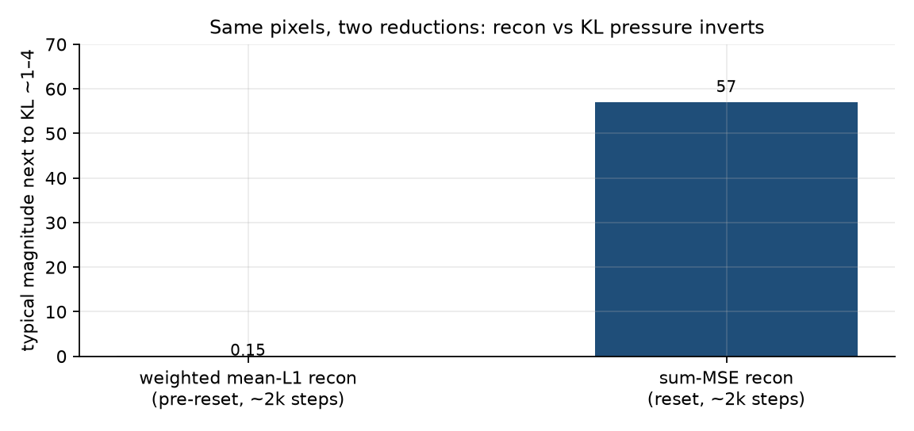
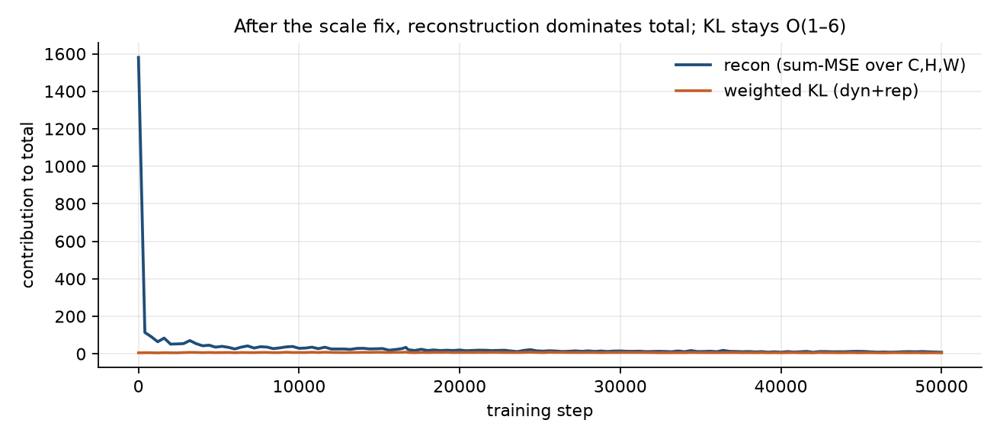

# Finding 02 — Per-pixel mean reconstruction inverts the paper’s loss ratio

**Status:** established  
**Kind:** loss-*reduction* bug (not a missing term, not a learning-rate bug)  
**Evidence:** scale arithmetic on 64×64×3; 1950-step and 50k logs after the fix

## Claim

DreamerV3’s image loss is (effectively) **squared error summed over `C×H×W`, then averaged over batch and time**. A per-pixel **mean** L1/MSE on the same 64×64×3 frame is smaller by a factor of `3×64×64 = 12 288`. KL is already in nats, O(1) after free bits. Mean-reduced recon at `recon_scale=5` was therefore **O(0.03–0.15)** next to KL **O(1–2)** — the opposite of the paper, where reconstruction dominates and KL is the small regularizer.

This is why two weeks of “raise recon, add blob, add HUD” never produced sprites. The extra terms were trying to buy detail with a reconstruction pressure that KL already outvoted.

## The arithmetic (keep this in the paper)

Let `e` be typical per-pixel absolute error ~0.03 after a bit of training (our pre-reset `recon_l1`).

| reduction | formula | order of magnitude |
|---|---|---|
| mean L1 (what we trained) | `mean_{c,h,w} |pred−tgt|` | ~0.03 |
| with `recon_scale=5` | `5 × 0.03` | ~0.15 |
| DreamerV3-style sum MSE | `sum_{c,h,w} (pred−tgt)^2` | hundreds of nats at early error; **~57 at step 1950** on the reset run |
| KL after free bits | `max(free_nats, KL)` | ~1–6 |



*Figure. Same pixels, two reductions. Left is the pre-reset trained recon term next to KL. Right is the reset trained recon term at a similar early step.*

On the **reset** graph at step 1950 (paper `dyn_scale=0.5` / `rep_scale=0.1`, before we retuned those):

```
total=61.08  recon=57.15  recon_l1=0.0316  kl=3.72  (dyn_raw=rep_raw=6.20)
```

That is the paper ratio: reconstruction is the bulk of `total`. `recon_l1=0.0316` is a **log-only** metric and is never multiplied into `total`. Mixing those two numbers on a dashboard is how you convince yourself the model is “not learning” when sum-MSE has already dropped from ~1580 (step 1) to ~57.

## What it is not

- It is not “L1 vs MSE as a perceptual loss.” The killer was the **reduction**, not the norm.
- It is not solved by `recon_scale=5` on a mean. 5 / 12288 still leaves recon negligible.
- It is not a reason to add per-region losses. Those were compensating for a scale bug; they also biased the decoder toward tile-means (finding 04).

## After the fix

`image_mse_loss` in `src/training/losses.py`: sum over pixels, mean over `B,T`. `recon_scale=1`. At 50k, `recon` (the trained term) is ~8.5 and weighted KL ~5.3 — still recon-led, KL alive.



## Paper spin

A one-paragraph “implementation pitfall” with the 12 288× factor and a bar chart is more useful to other reimplementers than another architecture diagram. Cite it as *reduction mismatch*, not as a new objective.
