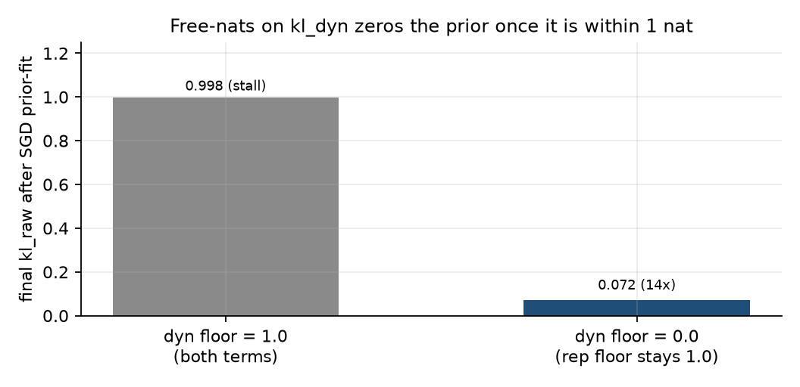
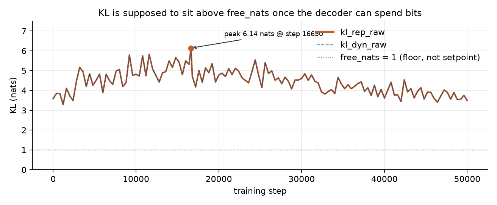

# Finding 03 — Free-nats on `kl_dyn` freezes the prior

**Status:** established (unit test + 12k-run plateau)  
**Kind:** KL-balancing implementation detail that DreamerV3 does not discuss  
**Evidence:** SGD prior-fit unit test; 12k run with `kl_raw` welded to 1.0; 50k run with `free_nats_dyn=0`

## Claim

`kl_dyn` trains the **prior** with the posterior **detached**. It cannot restrict information at all — it only makes `z_prior` better at matching `z_posterior`. Applying the same `max(free_nats, ·)` floor to `kl_dyn` as to `kl_rep` is therefore not “free bits on the latent.” It is **a stop-gradient on the dynamics model** once the prior is within one nat.

Once the prior is frozen:

1. Anything the prior already predicts costs **zero rate**.
2. Anything that *moves* (player, sapling, cow, zombie, HUD digit change) must be paid for out of the posterior’s ~1 nat budget.
3. 1 nat over 32 categoricals is ~0.031 nats each. The posterior drops the movers. Sprites never appear, and no recon weight can put them back.

DreamerV3’s published default floors **both** terms. We are **not** claiming the paper is wrong at full compute / online data. We are claiming that on a **frozen random-policy replay**, with a decoder that has become good enough to spend leftover nats, flooring `kl_dyn` produces a closed loop that looks like “KL is healthy because it sits on `free_nats`.”

## Unit test (plain SGD, fixed posterior)

| dyn floor | final `kl_raw` |
|---|---|
| 1.0 (same as rep) | 0.998 (stalls on the floor) |
| 0.0 (rep floor stays 1.0) | 0.072 |

14× better prior from an identical rate budget. The rate constraint did not change; the dynamics model was allowed to keep learning.

## Related clamp bug: per-categorical vs joint

The `stoch` categoricals are independent, so the joint KL at one timestep is the **sum** over variables. `max(free_nats, KL)` in Dreamer applies to that **per-timestep sum**. Clamping each of 32 variables to 1 nat *before* summing demands 32 nats of free information — the floor never lets go, and `kl_loss` sits on the line “almost indefinitely” even after the latent is informative.

This is in `kl_balance`’s docstring in `src/training/losses.py`. It is easy to miss because both versions “look like the paper.”

## Interaction with a strong decoder (12k pre-reset)

After `free_nats_dyn=0` on the *old* graph, KL did fall under 1 for a while (steps 2k–4.5k: mean 0.92, 76% of logs `< 1`), then the decoder got good enough to spend leftover nats and KL climbed again (4.5k–12k: mean 1.35). Those extra ~0.35 nats bought **grass texture**, not sprites — because recon was still mean-reduced and region-weighted (findings 02 and 04). So: opening the dyn floor is necessary, not sufficient.

## How to read the 50k reset KL curve

`free_nats=1.0` on **rep** only; `free_nats_dyn=0.0`. KL is **not** a setpoint.

- Start: ~3.6 nats
- Peak: **6.14 nats at step 16 650**
- Finish (50k): **3.49 nats**
- Dead would be `< 0.02`. Exploded would be `> 30`.

The peak-then-decline is the prior catching a posterior that was packing bits while recon dropped 97%. Gluing this curve to 1.0 is the old freeze.

`kl_dyn_raw` and `kl_rep_raw` overlapping is **not** a logging bug. Both are `KL(post ‖ prior)` on the forward pass; stop-grad only changes which side gets the gradient.

## Paper spin

Two related implementation results:

1. Free bits on the **rate** term (`kl_rep`) vs the **dynamics** term (`kl_dyn`) are not interchangeable.
2. Free bits are a **floor**, not a target. A 50k Crafter size-S run that *passes* M3 (reward `r = 0.91`) sits at ~3.5 nats, not 1.

A small ablation (dyn floor 1 vs 0, identical everything else) is a real figure if we re-run it on the reset graph. The unit test is only mechanistic evidence so far.
