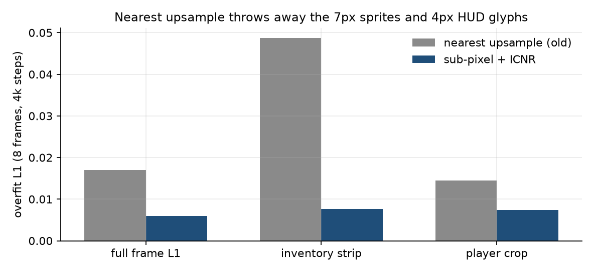
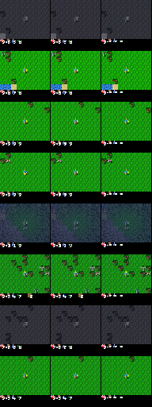

# Finding 04 — Crafter’s 7px geometry vs a 4×4 latent

**Status:** established (capacity overfit + several failed losses)  
**Kind:** environment-geometry result; not in DreamerV3  
**Evidence:** `scripts/smoke_decoder_capacity.py`; HUD/blob/paste postmortems

## Claim

Crafter’s 64×64 observation is not “a small Atari frame.” It is a **9×7 local grid of 7px tiles** plus a **2×9 inventory strip** (14px tall) concatenated on `y`, then transposed. The player is locked to the centre tile. A 4-stride CNN therefore stores the whole local view in a **4×4** map, so **one latent cell is 16×16 pixels** — larger than a tree, a zombie, a sapling, the player, and the entire HUD strip height.

Any decoder or loss that treats the frame as a uniform 64×64 image will spend its budget on grass and miss the objects that make Crafter *Crafter*. Extra crop losses looked like the fix and were not.

## Layout (from `crafter.env.Env.render`, encoded in `src/models/crafter_layout.py`)

```
unit = 64 // 9 = 7 px / tile
world: rows [0, 49), cols [0, 63)     # 7×9 tiles
HUD:   rows [49, 63), cols [0, 63)    # 2×9 slots
pad:   row 63, col 63
player centre: (y=21, x=28)           # tile (3, 4) in the local grid
```

Inventory **glyphs** are ~4px inside a 7px slot. Movers (cow, zombie, sapling) are ~7–8px. If the decoder cannot represent sub-cell phase, those objects are geometrically unrepresentable no matter the loss.

## Nearest upsample discards sub-cell phase

`Upsample(mode="nearest")` copies each 4×4 cell into a 2×2 block of **identical** activations. The following 3×3 conv cannot tell *where inside the 16×16 cell* it is. That is exactly the phase a 7px sprite and a 4px digit are made of. It also produces the “flat 16×16 blocks” we kept blaming on frozen decoder weights.

Replacement: sub-pixel conv (`Conv2d(in, out×4)` + `PixelShuffle(2)`) with **ICNR** init so the four sub-filters start identical (begins as nearest, no checkerboard).

Capacity check: overfit **8 real frames**, 4000 steps, identical seed/data, sub-pixel vs nearest control (`results/m3/decoder_capacity_4k.png`):

| region | sub-pixel | nearest |
|---|---|---|
| full frame L1 | 0.0059 | 0.0170 |
| inventory strip | **0.0076** | **0.0487** (6.4× worse) |
| player crop | 0.0074 | 0.0145 |





*Figure. Nearest control smears the inventory into dashes — the same HUD symptom as the 12k world-model runs. That is a representation ceiling, not a loss-weight problem.*

## `HzToMap` gave `h` no spatial slot

`h_proj(h).unsqueeze(-1).unsqueeze(-1)` is a `[B, C, 1, 1]` bias, **identical in all 16 cells**. All layout then came from `z`. A 32×32 categorical latent is **160 bits/frame**. That is not enough to place 63 tiles plus a 9-slot inventory, so `[h,z]` hallucinated terrain while embed recon (which still saw the 4×4 CNN map) looked better. Persistent Crafter layout (grass, water, trees) is exactly what `h` is for — if you give it a map.

This was the right diagnosis **on the old graph**. The M3 reset dropped `HzToMap` entirely: DreamerV3’s decoder is a dense layer on `feat`, and size-S is allowed to be blurry. Do not revive `HzToMap` as a “fix” on the paper graph without an ablation.

## Losses that *look* Crafter-aware and make it worse

**Tile-mean blob L1 (`recon_blob_scale=5`).** 7px tile-mean error paints each tile one color. Combined with a 4×4 upsample this is solid-color terrain + one HUD icon. We turned it off; resuming a blob-trained decoder did not grow texture — had to start from scratch.

**Pasted HUD head.** A dedicated decoder for rows 49–63 that *composited* over the world recon hid whatever the 64×64 decoder learned and left a **black bar**. Inventory must be painted by the same upsample as the world. Extra `recon_hud` / `recon_avatar` scales of 5.0 flattened recon; even 0.5 is a ~1.9× total-weight bump on those pixels and is on the do-not-revive list for the reset.

**Skinny 4-stride CNN (no residual blocks).** 8–12px sprites alias into grass at the first downsample. DreamerV3’s `ImageEncoderResnet` is stride-2 then residual 3×3 pairs per scale. Skip-free 4×4 flatten is required (U-Net skip-to-RGB copies the frame around the RSSM — finding 01/07), but the *encoder* still needs those residual pairs.

## Paper spin

A figure with (a) the 7px layout annotated on a real frame, (b) 4×4 cells drawn as 16×16 overlays, (c) nearest vs sub-pixel HUD crops. The scientific point is: **benchmark geometry can make a standard CNN upsample an information bottleneck that no auxiliary loss can repair.** DreamerV3 never had to explain this because they did not use nearest upsample + crop losses.
