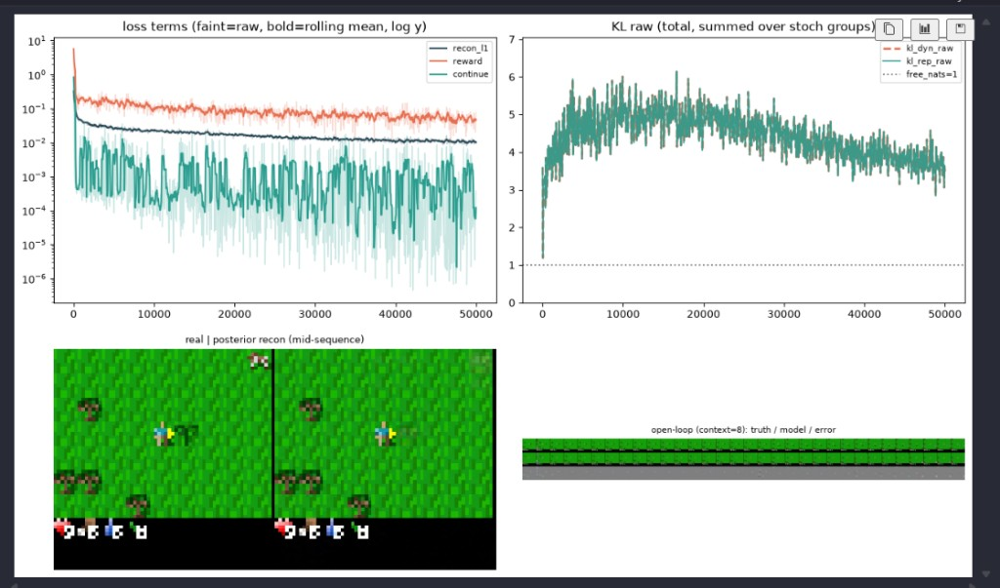
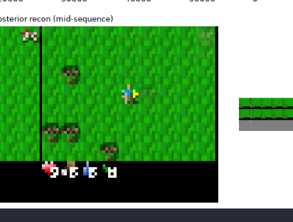

# Finding 05 — Ghost movers are MSE + coverage, not a missing head

**Status:** established at 50k; 300k continuation will update the “how far MSE gets” clause  
**Kind:** qualitative failure mode that *looks* like an architecture bug  
**Evidence:** 50k posterior stills; user-identified sapling/cow/zombie residue; failed crop-loss era

## Claim

After a healthy size-S world-model run, **trees, player, terrain, and HUD blocks reconstruct**; **saplings, cows, zombies** show up as faint same-color smudges in the right neighborhood. That residue means the latent already allocated bits and the decoder **will not commit to a sprite**. Squared error averages modes. A random-policy replay barely contains those objects. Adding `recon_blob` / `recon_avatar` / a sapling loss is how we spent two weeks fighting the RSSM (finding 01, 04).

This is not in DreamerV3 as a result. The paper’s Crafter reconstructions are recognizable and blurry; they do not claim pixel-perfect mobs from a 50k-step frozen-buffer run.

## What 50k actually got right

M3 exit cell (2026-08-24):

| gate | number |
|---|---|
| `recon_l1` | 0.326 → **0.0095** (97% drop) |
| reward NLL | 5.63 → **0.077** |
| continue BCE | 0.84 → **0.0004** |
| `kl_rep_raw` | **3.49** (alive) |
| open-loop pixel-std ratio | 0.99 (not a constant frame) |
| reward correlation | **r = 0.91** |

Visually: grass grid, trees, player (blue shirt / yellow tool), HUD hearts and digits. Two weeks earlier none of that survived `[h,z]`.

*Figure. Faint blobs where a cow/sapling/zombie should be. If the decoder could not represent ~8px sprites, the player and trees would also be gone. Residue is the opposite of a capacity failure.*

## Why “train a crop loss” is the wrong next step

1. **MSE averages modes.** Uncertain zombie column → transparent smear. Longer training helps only once `z_posterior` is actually sure.
2. **600 random episodes.** Zombies / saplings / cows are rare. The model is allowed to cheap out. 80 episodes (the previous dump) was worse: mean-grass memorization.
3. **50k is short relative to DreamerV3**, and it is **offline**. Online collect (M5) is when those objects become frequent because the policy starts looking for them.
4. **Size-S, `blocks=1`.** Paper CNN uses `cnn_blocks=2`. The first 64→32 downsample is where 8–12px sprites die. Raising blocks is an honest capacity knob; a sapling loss is not.
5. **Do not lower KL to 1 to “clean” the image.** Those ghosts *are* the leftover nats (finding 03, 06).

## What we set up instead

Same graph, **300k steps**, resume from the 50k checkpoint (`RESUME=auto`, `ckpt_latest.pt`). Hypothesis to test, not a promise: cows/player firm up before zombies/saplings; if ghosts remain at 200k+, the limiter is **random-replay coverage**, not step count.

Update this finding with 100k / 200k / 300k stills when those exist. Do not add per-object losses while that run is the experiment.

## Paper spin

A “limitations / what reconstructions are for” subsection: world-model success on Crafter is **reward prediction + open-loop that stays Crafter-like**, not sprite sheets. Ghost movers are a predicted MSE signature under class imbalance. Contrast with the pre-reset regime where movers were **absent even as residue** because `z_posterior` never had to carry them (finding 01).
