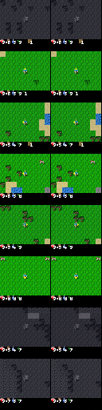

# Finding 05 — Ghost movers are MSE + coverage, not a missing head

**Status:** established at 50k; **updated 2026-08-25 after 700k**  
**Kind:** qualitative failure mode that *looks* like an architecture bug  
**Evidence:** 50k posterior stills; 700k `recon_final.png`; failed crop-loss era

## Claim

After a healthy size-S world-model run, **trees, player, terrain, and HUD blocks reconstruct**; **saplings, cows, zombies** show up as faint same-color smudges in the right neighborhood. That residue means the latent already allocated bits and the decoder **will not commit to a sprite**. Squared error averages modes. A random-policy replay barely contains those objects. Adding `recon_blob` / `recon_avatar` / a sapling loss is how we spent two weeks fighting the RSSM (finding 01, 04).

This is not in DreamerV3 as a result. The paper’s Crafter reconstructions are recognizable and blurry; they do not claim pixel-perfect mobs from a frozen-buffer run.

## What 50k actually got right

M3 exit cell (2026-08-24):

| gate | number |
|---|---|
| `recon_l1` | 0.326 → **0.0095** (97% drop) |
| reward NLL | 5.63 → **0.077** |
| continue BCE | 0.84 → **0.0004** |
| `kl_rep_raw` | **3.49** (alive) |
| open-loop pixel-std ratio | 0.99 (not a constant frame) |
| reward correlation | **r = 0.91** |

Visually: grass grid, trees, player (blue shirt / yellow tool), HUD hearts and digits. Two weeks earlier none of that survived `[h,z]`.

*Figure. Faint blobs where a cow/sapling/zombie should be. If the decoder could not represent ~8px sprites, the player and trees would also be gone. Residue is the opposite of a capacity failure.*

## What 700k added — and what it did not

Same graph, same 600-episode dump, resumed to **700k** (M3 exit 2026-08-25):

| gate | 50k | 700k |
|---|---|---|
| `recon_l1` (last log) | 0.0095 | 0.0062 |
| `recon_l1` (last-10k mean) | — | **0.0045** |
| reward correlation r | 0.91 | **0.98** |
| open-loop imag std / obs std | 0.99 | **0.98** |
| `kl_rep_raw` (window) | 3.49 | **~1.96** |

*Figure. 700k posterior: terrain, player, trees, water, caves, HUD icons. This is past the M3 bar (“blurry but recognizable”). Extra sharpness is not a reason to add crop losses, and not a reason to grind to 1M (finding 09).*

Player / trees / HUD firmed up with more steps, as hypothesized. Rare movers remain a **coverage** problem: 600 random episodes still barely contain cows/zombies/saplings. The limiter at 700k is the buffer, not step count. Online collect (M5) is when those objects become frequent because the policy starts looking for them.

## Why “train a crop loss” is still the wrong next step

1. **MSE averages modes.** Uncertain zombie column → transparent smear. Longer training helps only once `z_posterior` is actually sure **and** the object is in the data.
2. **600 random episodes.** Zombies / saplings / cows are rare. 80 episodes (the previous dump) was worse: mean-grass memorization.
3. **700k is long relative to the 50k gate, and it is still offline.** Remaining ghosts after that are coverage (finding 09), not a missing head.
4. **Size-S, `blocks=1`.** Paper CNN uses `cnn_blocks=2`. Raising blocks is an honest capacity knob; a sapling loss is not.
5. **Do not lower KL to 1 to “clean” the image.** Leftover nats are not a crop-loss budget (finding 03, 06).

## Paper spin

A “limitations / what reconstructions are for” subsection: world-model success on Crafter is **reward prediction + open-loop that stays Crafter-like**, not sprite sheets. Ghost movers are a predicted MSE signature under class imbalance. Contrast with the pre-reset regime where movers were **absent even as residue** because `z_posterior` never had to carry them (finding 01). 700k shows the residue can remain after the plateau — that is the coverage result, not an unfinished run.
