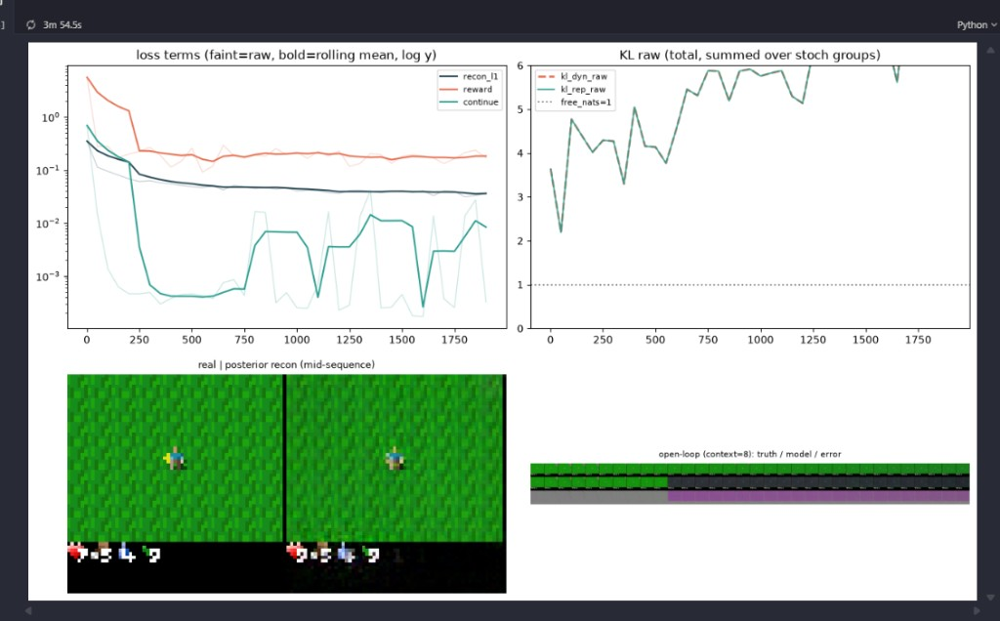
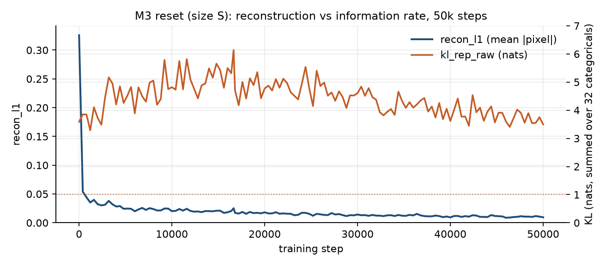
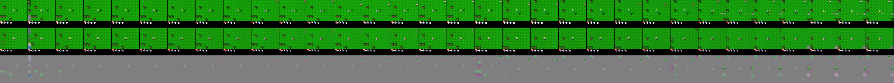

# Finding 06 — Published KL scales disagree, and size-S sum-MSE exposes it

**Status:** established at 50k with retuned scales; not a claim that DreamerV3’s tables are “wrong”  
**Kind:** paper ↔ reference-implementation mismatch + our measured consequence  
**Evidence:** step-1950 log at paper YAML weights; 50k log at `dyn=1.0` / `rep=0.5`

## Claim

DreamerV3 **Table 4** lists `dyn_scale = 1.0`. `NM512/dreamerv3-torch` `configs.yaml` (the runnable size-S recipe we copied first) uses `dyn_scale=0.5`, `rep_scale=0.1`. Those two published sources disagree. On **our** size-S graph with **sum-over-pixels MSE**, the YAML pair lets the posterior **buy bits faster than the prior can catch**: recon ~57 vs weighted KL ~3.7 at step 1950, `kl_*_raw = 6.2` and still climbing.

This is not “KL balancing as in the paper.” It is: *once reconstruction is correctly huge (finding 02), the reference YAML’s KL coefficients are too small for a frozen-buffer Crafter run.*

## Timeline (same reset graph)

**Attempt A — paper-YAML KL, 1950 steps (aborted):**

```
recon=57.15  recon_l1=0.0316  kl=3.72  dyn_raw=rep_raw=6.20
```

Recon ratio was healthy (finding 02). KL was not: posterior packing extra bits, prior 1×512 hidden layer on a 4096-d embed / 32×32 posterior.



**Attempt B — retune, restart from step 0, 50k steps:**

| knob | YAML 0.5/0.1 | what we ran |
|---|---|---|
| `dyn_scale` | 0.5 | **1.0** (matches Table 4; trains the prior harder) |
| `rep_scale` | 0.1 | **0.5** (penalize posterior drift) |
| `free_nats` | 1.0 both | 1.0 on **rep only** |
| `free_nats_dyn` | 1.0 | **0.0** (finding 03) |
| `prior_layers` | 1 | **2** (512→1024 waist could not track the posterior) |

50k outcome:

| window | mean `kl_rep_raw` | mean `recon_l1` |
|---|---|---|
| 1–2k | 3.64 | 0.054 |
| 2k–5k | 4.52 | 0.030 |
| 5k–10k | 4.81 | 0.024 |
| 10k–20k | **4.94** (peak region; max 6.14 @ 16650) | 0.019 |
| 20k–35k | 4.59 | 0.014 |
| 35k–50k | **3.89** | 0.011 |
| step 50000 | **3.49** | **0.0095** |

Shape: **rise while recon is still falling fast, then decline as the prior catches up.** That is the opposite of the pre-reset “welded to 1.0 forever” curve.




## What we are not claiming

- That `dyn=1.0` / `rep=0.5` is the globally correct DreamerV3 setting.
- That KL should return to 1.0. Floor ≠ setpoint (finding 03).
- That open-loop imagination for M4 is proven. The 50k video-pred strip is a diagnostic; actor-critic horizons can still smear. Revisit if 15-step imagination is junk.



## Paper spin

A small “sources disagree” paragraph plus **our** 50k curve is a legitimate reimplementation note. If we later ablate `0.5/0.1` vs `1.0/0.5` on the **same** reset graph for 50k, that becomes a real result rather than a one-run retune. Until then, label it as a measured incompatibility between sum-MSE reconstruction and the torch-repo size-S KL coefficients on frozen Crafter replay.
