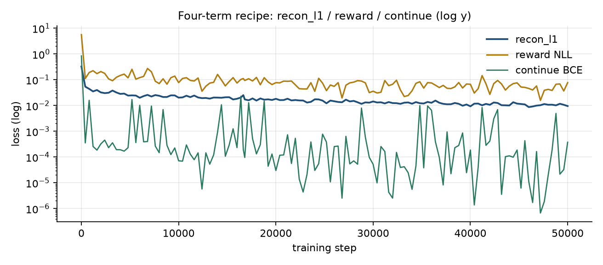

# Finding 07 — Several “the model is dying” signals were logging artifacts

**Status:** established  
**Kind:** evaluation / dashboard pitfalls; easy to accidentally put in a paper figure  
**Evidence:** resume 8k→12k; continue term on log-y; embed-vs-`[h,z]` panels; `clear_output`; bf16 video-pred

## Claim

A world-model training dashboard can show **explosions, stalls, and empty latents** that are not in the weights. If those screenshots go in the paper without the caveat, the result is unreproducible folklore. These are ours:

## 1. Resume with an empty `history` looks like a loss explosion

On the 8k→12k resume, `history = []` so the x-axis started at 8000 and the y-axis autoscaled a **0.006 wiggle** to the full panel height. That was reported as “loss through the roof.” Fix: reload `train_metrics.json` on resume; anchor y at 0.

**Paper rule:** never plot a resumed run without the pre-resume curve, and never autoscale a near-flat series as if it were a blow-up.

## 2. `continue` on a log axis is a 100× “spike” from one terminal

At 50k the continue BCE is ~`4e-4`. Most Crafter steps are `continue=1`, so the mean sits near zero. A single `done=True` in a batch of 16×32 moves the log plot by orders of magnitude. Linearly it is noise. The 50k dashboard’s teal spikes are this, **not** an exploding head. `recon_l1` and reward were at their **lowest** at 50k.

**Paper rule:** plot continue on a linear axis, or plot `P(terminal)` / a histogram of episode lengths, not log-BCE.

## 3. Embed recon vs `[h,z]` recon is not a capacity plot

On the pre-reset dashboard, a sharp embed column next to a dead `[h,z]` column was read as “decoder can’t render.” It was the bypass (finding 01). **Any figure that shows two reconstructions must name the tensor each came from.** After the reset there is only `recon` from `z_posterior`.

## 4. Mid-sequence vs `t=0`

Visualizing reconstruction at `t=0` of a sampled window shows the RSSM with almost no context. We moved vis to **mid-sequence**. A paper figure of “the world model can’t see the room” can be an off-by-one of the plotted timestep.

## 5. `clear_output(wait=True)` can freeze the notebook, not CUDA

Training “stuck” at ~8500 with GPU util ~1% and VRAM still held: the Jupyter UI was blocked on `clear_output(wait=True)`, not the train step. `wait=False` and one dashboard draw per log tick. A “steps/s dropped to 0” anecdote without `nvidia-smi` is not evidence.

## 6. AMP bf16 cannot `.numpy()`

`video_predict` tensors stayed bf16; NumPy refused them; the open-loop panel went gray. That gray strip was **not** a dynamics collapse. Cast to float32 on CPU before uint8. Do not cite early gray open-loop panels as prior failure.

## 7. `kl_dyn_raw == kl_rep_raw` is the forward KL

Stop-grad does not change the forward value. Overlapping curves are expected. A paper caption that says “both KL terms identical, so balancing is broken” would be false.

## 8. `free_nats` drawn as a target line

A horizontal line at 1.0 on the KL plot is a **floor on the loss**, not a goal. Captions should say so (finding 03, 06). The 50k run *passes* M3 at 3.5 nats.

## Paper spin

A short “how we evaluate reconstructions and KL” subsection prevents us (and reviewers) from treating dashboard bugs as model bugs. Include one “gotcha” figure: the same continue series on linear vs log y.
