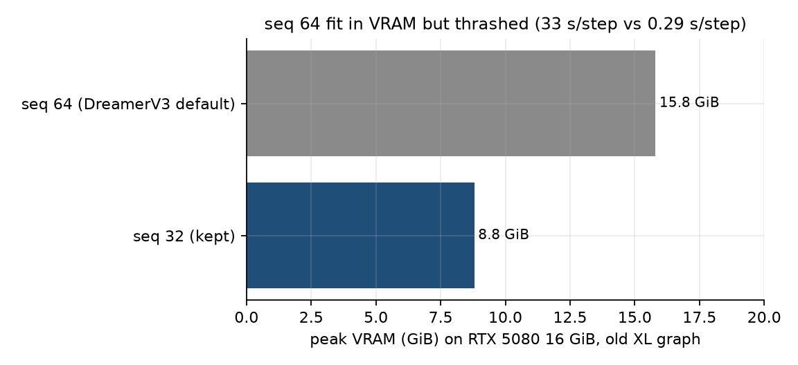

# Finding 08 — Workstation constraints that actually changed the recipe

**Status:** established on this machine (RTX 5080 16 GiB, 32 GiB RAM, Windows)  
**Kind:** compute / systems results; DreamerV3 assumes cluster-scale defaults  
**Evidence:** `scripts/smoke_cuda_step.py`; seq-64 timing; replay sizes; Jupyter VRAM holds

## Claim

Several “hyperparameters” in this repo are **not** scientific choices. They are what a 16 GiB Blackwell card plus a 32 GiB host can run without lying (thrashing, CPU wheels, leftover kernels). A paper that copies DreamerV3’s seq 64 / huge replay / always-on collect without this appendix will not reproduce our numbers — and should not pretend to.

## seq 64 fits in VRAM and is still unusable

DreamerV3 default sequence length is 64. On the **old XL** graph, seq 64:

| | seq 32 | seq 64 |
|---|---|---|
| peak VRAM | 8.8 GiB | **15.8 / 16.3 GiB** |
| time / step | 0.29 s | **33 s** |

It did not OOM. It **thrashed** (paging / allocator churn with the desktop compositor already holding ~1.5 GiB). We kept seq 32. The 32×32 categorical latent was **not** shrunk — VRAM knobs are batch/seq, not `stoch`.

After the reset (~19M params, one decoder) a step is ~2.4 GiB / ~7.5–8.5 it/s at batch 16 × seq 32. Headroom exists; we still have not promoted seq 64 without a new smoke. **Do not silently bump it in an ablation.**

## CUDA 12.8 is a correctness constraint, not a speed tip

RTX 50-series (sm_120) on a cu124/cu121 or default PyPI wheel: `cuda.is_available()` may be false, or “no kernel image.” Windows default `pip install torch` is **CPU-only**. Every timing number in this archive assumes `torch` from `https://download.pytorch.org/whl/cu128` and bf16 AMP (no GradScaler).

## Replay size on a frozen random policy is a data-coverage knob

| dump | what happened |
|---|---|
| ~80 random episodes | unique frames reused hundreds of times over 12k steps; mean grass |
| **600** random episodes, max 400 steps | current M3 reset; still sparse on cows/zombies/saplings (finding 05) |

M3 is **supervised on a frozen buffer**, not DreamerV3’s online loop. Comparing our 50k-step reconstructions to published DreamerV3 Crafter figures without stating that is misleading.

## Dual XL decoders vs one size-S decoder

Residual decoder **twice** (embed path + `[h,z]` path) used **19 GiB** — over the card. One residual decoder at depth 32 is fine. Several “we can’t use DreamerV3’s CNN blocks” conclusions were **graph duplication**, not model size.

| graph | params | peak VRAM (batch 16×32, bf16) |
|---|---|---|
| pre-reset XL dual decoder | ~120–146M | ~9–13 GiB |
| reset size-S one decoder | **18.7M** | **~2.4 GiB** |

## Jupyter kernels hold the card after the loop stops

A finished or interrupted notebook kernel kept **~11 GiB** with GPU util ~1%. TensorBoard event files named `*.ghost.<pid>` matched that PID. This is not a PyTorch leak in the train step; it is the interactive workflow. Training and a 16 GiB game do not coexist (max-settings Spider-Man was the practical test: both want most of the 16 GiB; PyTorch’s caching allocator will not shrink).

## `is_first` is not threaded yet — and that is consistent with our sampler

DreamerV3 replay is a stream; a sampled window can **cross an episode boundary**, so `is_first` resets GRU state mid-sequence. `ReplayBuffer.sample` here only returns windows with `start + seq_len <= episode_len`. There is no boundary to reset across **yet**. This becomes mandatory at M4/M5 if the buffer becomes a stream. Until then, claiming “we match DreamerV3 replay” is false.

## Paper spin

Hardware appendix: 16 GiB, seq 32, bf16, 600-episode frozen buffer, ~19M size-S, 50k steps, ~8 it/s. Limitations: single seed, single env, no online collect, `is_first` unused. That is an honest small-scale study, which is the project’s stated research goal — not a competing DreamerV3 number.
