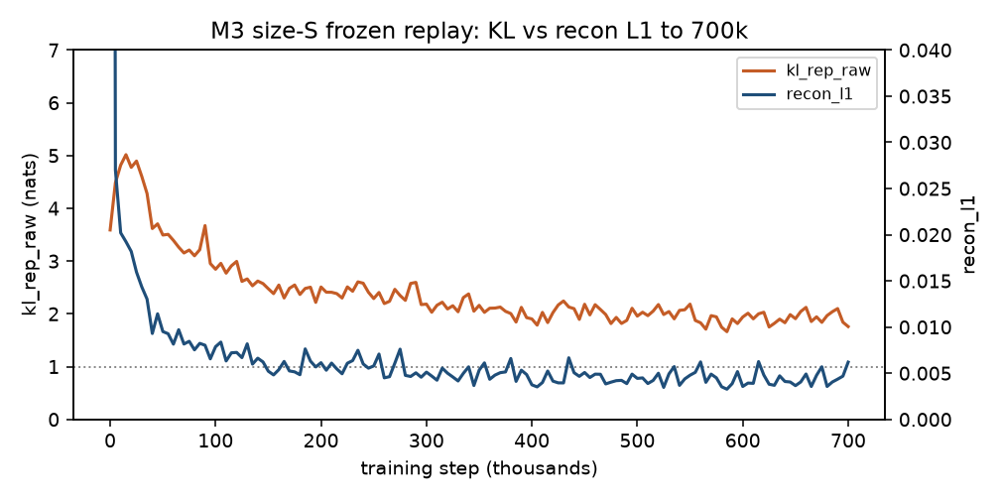

# Finding 09 — Frozen-replay world-model steps plateau after ~500k

**Status:** measured on the M3 size-S reset, 700k gradient steps, 2026-08-25  
**Kind:** negative result / compute; “just train longer” vs coverage  
**Evidence:** 14,006 logs in `results/m3_dreamer_s/train_metrics.json`; notebook exit cell at step 700000; `recon_final.png` / `video_pred_final.png`

## Claim

On a **frozen 600-episode random-policy Crafter replay**, extra world-model gradient steps after ~500k buy almost nothing. Last-10k window means: `recon_l1` 0.00468 → 0.00452, `kl_rep_raw` 2.03 → 1.96. Last-50k KL slope is **−0.001 nats per 10k steps**. Zero of the last 100k logs sit under `free_nats=1.0` (median 1.96). DreamerV3’s published “1M steps” is **online environment interaction** with a learning policy, not 1M decoder updates on this buffer.

This is not in the paper. Treating 1M WM gradient steps as the DreamerV3 compute budget on a frozen random replay is a category error.

## Numbers (window means, log_every=50)

| window | mean `recon_l1` | mean `kl_rep_raw` | mean reward MAE |
|---|---|---|---|
| 45k–50k | 0.0108 | 3.72 | 0.0076 |
| 295k–300k | 0.0052 | 2.20 | 0.0011 |
| 495k–500k | 0.0047 | 2.03 | 0.0009 |
| 595k–600k | 0.0044 | 1.95 | 0.0006 |
| 690k–700k | 0.0045 | 1.96 | 0.0007 |

The single last log (`recon_l1=0.0062` at step 700000) is one noisy batch. The 690k–700k window is the number that matches the plateau.

Exit cell at 700k (M3 gates, all PASS): recon L1 drop 98%; reward correlation **r=0.98**; open-loop imagined pixel-std ratio **0.98**; `kl_rep_raw=1.76` (alive, not exploded). Posterior stills are already past “blurry but recognizable.”

*Figure. Same reset graph as finding 06. After the 16.7k KL peak, the curve falls then **flattens near 2 nats**. The dotted line is `free_nats=1.0` — a floor, not a target (finding 03). Downsampled from 14,006 logs (every 5k).*

## What extra steps would not have bought

Extrapolating the last-200k KL slope (−0.004 / 10k) through another 300k steps gives ~0.04 nats — inside batch noise. Leftover KL above 1 nat on this buffer is texture the decoder still spends, not a prior the actor is missing (finding 06). Rare movers stay rare because the **replay does not contain them**, not because 700k was short (finding 05).

A 1M grind on this dump also overfits the random-policy visual distribution. New trajectories have to come from a learning agent (M5), not from more epochs on the same 600 episodes.

## Failed alternative we are not running

Push 700k → 1M on `RESUME=auto` because “DreamerV3 trains for 1M.” That 1M is env steps in the outer loop. ~15 hours at 5.6 steps/s for a 0.04-nat KL move is how we would have spent a day not starting actor-critic.

## Paper spin

Limitations / compute: workstation-scale M3 is **700k frozen-replay gradient steps, then stop**. Do not compare our reconstructions to published DreamerV3 Crafter figures without stating the buffer is offline random policy. The interesting number is the **plateau**, not the last tick.
