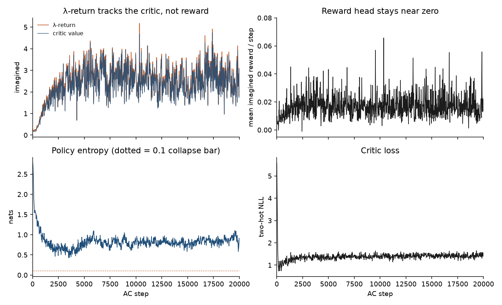
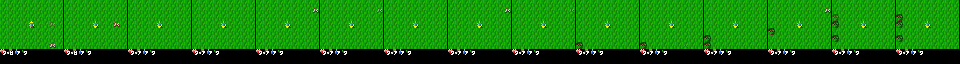
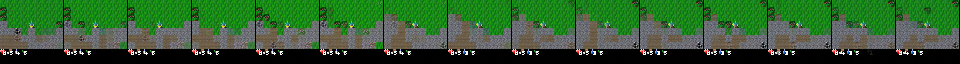
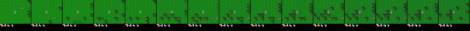

# Finding 10 — Imagined λ-return is not Crafter skill on a frozen random-policy world model

**Status:** measured on M4, 20k actor-critic steps, 2026-08-26  
**Kind:** evaluation / dashboard pitfall; M4 pass does not imply a policy  
**Evidence:** 1001 logs in `results/m4_actor_critic/train_metrics.json`; notebook exit cell PASS; `imagine_final.png` / `imagine_final.gif`

## Claim

On a **frozen 700k world model trained on random-policy Crafter replay**, actor-critic training makes the **λ-return curve climb** while the imagined **reward per step stays near zero**. Last-2k window: mean reward **0.017**, mean λ-return **2.61**, mean critic value **2.53**. The return plot is the critic bootstrapping itself under `γ = 0.997`, not achievements. Treating that curve as a Crafter score — or as a reason to delay the outer loop — is the same class of dashboard lie as finding 07.

This is not in DreamerV3. The paper always reports **real** env return. Isolated M4 has no `env.step`.

## Numbers (log_every=20)

Zero non-finite values in 1001 logs. Imagined reward range **[-0.001, 0.066]**; never `|r| > 1`.

| window | critic NLL | entropy (nats) | reward / step | λ-return | critic value | retnorm 5–95 |
|---|---|---|---|---|---|---|
| 1–400 | 1.70 | 1.86 | 0.0078 | 0.24 | 0.19 | 1.00 |
| 9.6k–10.4k | 1.40 | 0.81 | 0.018 | 2.65 | 2.57 | 8.01 |
| 18k–20k | 1.43 | 0.87 | 0.017 | 2.61 | 2.53 | 8.30 |
| last log (20k) | 1.47 | 0.81 | 0.023 | 2.19 | 2.10 | 7.86 |

Critic two-hot NLL: **5.59 → ~1.4** in the first few hundred steps, then a noisy plateau (last-5k slope **+0.005 / 1k**). That is a fitted 255-bin head, not a stall. Policy entropy: `ln(17) ≈ 2.83` at init → **0.58–1.10** in the last 5k; **0 / 1001** logs under the 0.1 collapse bar. Unimix 0.01 kept a floor.

*Figure. Top-left: λ-return (rust) overlays critic value (navy). Top-right: per-step imagined reward stays O(0.02). Bottom: entropy above the 0.1 bar; critic NLL after the initial drop.*

## What the decoded imagination shows

Early (step 200) and late (18k / final) strips are **Crafter**: grass, HUD bar, player sprite, trees/rocks. Late-horizon frames accumulate extra blobs — the M4 smear, not garbage from frame 1. Crafter’s camera is player-centered, so a centered sprite is not a no-op policy.

*Step 200 — open grass, HUD, entities entering from the edges.*

*Step 18k — biome boundary holds; HUD digits can tick down over the 15-step `z_prior` horizon.*

*Final strip — still Crafter for the first handful of frames; density of hallucinated rocks/trees rises toward t=15.*

## What M4 actually certified

`milestones.md` M4: finite imagined rewards, actor-critic loss down, decoded `z_prior` plausible for a handful of steps. Notebook exit cell: **PASS** (reward finite, entropy 0.814 > 0.1, critic 5.59 → 1.47, decode std 0.21). VRAM **1.20 GiB**. Throughput drifted 6.4 → 3.1 steps/s with VRAM flat — host/dashboard, not a GPU leak; the run finished.

It did **not** certify a Crafter policy. The frozen reward head was trained on sparse random play. The actor can inflate values inside that model without ever acting in the env.

## Failed alternative we are not running

Grind M4 past 20k, or retune entropy, because “return is only 2.6.” That number is bootstrap. More frozen-WM actor steps will not invent achievements that are absent from the 600-episode buffer (finding 09). Skill is a **real** `env.step` number. M5’s 4×400-step eval return ended at **0.10** and is still not a Crafter score (finding 11).

## Paper spin

Evaluation / limitations: any figure of “imagined return during actor-critic” must plot **reward per step next to λ-return**, or it will be read as a Crafter curve. M4 is a plumbing milestone. The first learning plot is real-env return after online collect.
