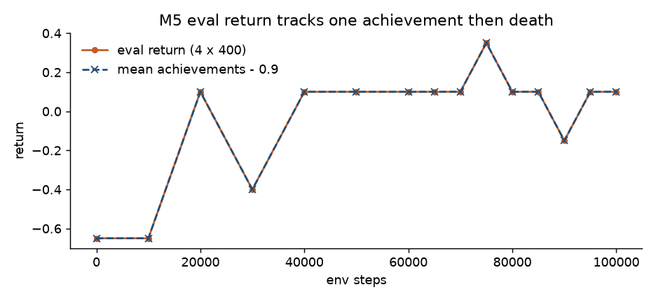

# Finding 11 — 4×400-step eval return is “one achievement, then die”

**Status:** measured on the M5 100k outer loop, 2026-08-26  
**Kind:** evaluation protocol; not a Crafter score  
**Evidence:** `results/m5_outer_loop/eval_metrics.json` (15 evals); `ckpt_latest.pt` at 100000 env steps; figure below

## Claim

The M5 “skill” plot is **real env return**, but on this protocol it is not skill. CrafterReward is **+1 per unlocked achievement** and **−0.1 per damage**. A policy that unlocks **one** easy achievement and then dies of hunger/zombies after ~9 health ticks lands on **0.1**. Every logged eval in this run is `mean_achievements − 0.9` to two decimals. 4 episodes × 400-step cap make that a staircase, not a learning curve.

This is not in DreamerV3. The paper’s Crafter number is a **geometric-mean achievement score** on **10k-step** episodes. That is M6. Treating M5’s last 0.100 as a baseline will not survive a reviewer who has read Hafner et al.

## Numbers

Notebook plumbing exit: **PASS**. 0 NaNs in 3825 train logs. Entropy last **0.943** (0 / 3825 logs under 0.1). Joint `ckpt_latest.pt` reloads (`env_steps=100000`, 6250 WM + 6250 AC updates = 100000/16). Last **train** log is **99840** because `log_every=256` does not land on 100000 — the loop still stepped to 100k (eval + `ckpt_step_100000.pt`).

| env_steps | eval return | mean achievements | achievements − 0.9 | mean length |
|---|---|---|---|---|
| 0 | −0.65 | 0.25 | −0.65 | 193 |
| 10k | −0.65 | 0.25 | −0.65 | 185 |
| 20k | 0.10 | 1.00 | 0.10 | 208 |
| 30k | −0.40 | 0.50 | −0.40 | 174 |
| 40k–70k, 80k, 85k, 95k, 100k | 0.10 | 1.00 | 0.10 | 171–257 |
| 75k | **0.35** | 1.25 | 0.35 | 196 |
| 90k | −0.15 | 0.75 | −0.15 | 182 |

The 75k “peak” is one extra achievement in the 4-episode bag (`std=0.43`). Ticks with `std≈0` are all four seeds returning **exactly 0.1**. Episode length stays **~180–220** against a 400-step cap — they **die**, they do not time out.

*Figure. Eval return overlays `mean_achievements − 0.9`. The overlay is the death cost of 9 × −0.1 health, not a fitted curve.*

## What else moved (and did not)

Online world-model recon L1 **0.005 → 0.013** and `kl_rep_raw` **2.1 → 6.1** (last-10k window). Frozen 700k sat at L1 **0.0045** / KL **1.96**. That rise is on-policy coverage + FIFO, not the 60k dashboard fix. Imagined λ-return **fell** from ~2.7 early to ~0.2 late — the critic leaving the frozen-WM bootstrap (finding 10), which is healthier than a climbing λ-return.

Decoded 15-step `z_prior` at 100k still looks like Crafter for the first frames, then extra blobs (same smear as M4). Real eval frames are a live Crafter episode, not a skill montage.

## Failed alternative we are not running

Grind this 100k checkpoint because “return only went 0.1 → 0.1 after 20k” or because 75k hit 0.35. More 400-step evals will resample the same staircase. Geo-mean + 10k-step episodes are M6. Do not change `eval_every` or entropy scale to beautify this plot.

## Paper spin

Evaluation: any 4-episode CrafterReward return figure must be shown next to **mean achievements and episode length**, or it will be read as a DreamerV3 Crafter curve. M5 certified the outer loop. The first comparable score is M6.
