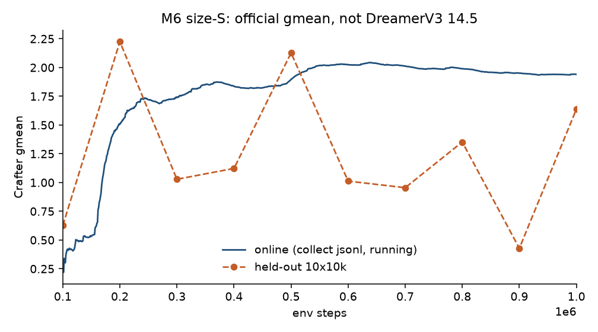
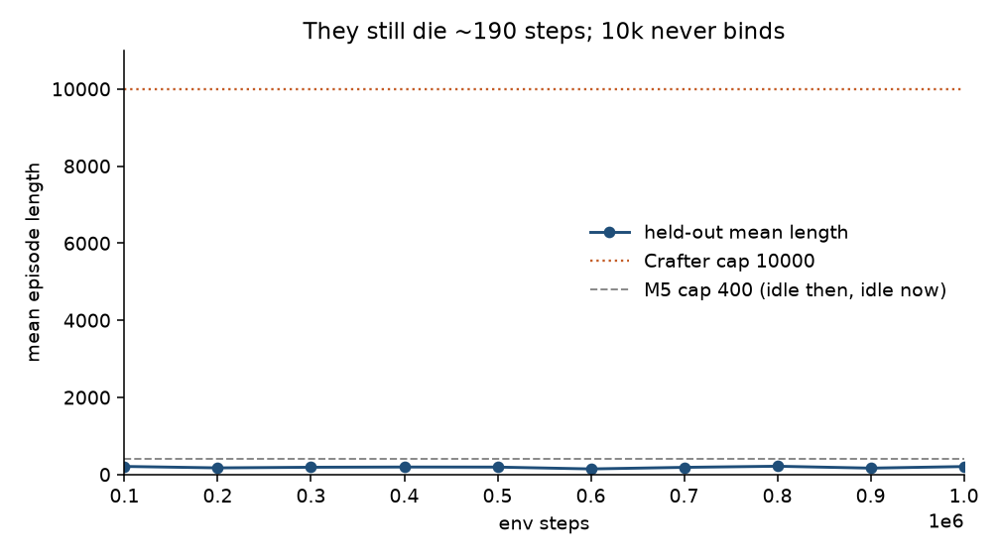

# Finding 13 — M6 1M gmean is 1.6; they still die at ~190 steps

**Status:** measured on M6 1M, 2026-08-26  
**Kind:** baseline result + eval identifiability; not a DreamerV3 14.5 comparison  
**Evidence:** `results/m6_baseline/eval_metrics.json` (10 ticks), `collect_episodes.jsonl` (4746 episodes), `train_metrics.json` (3517 logs)

## Claim

The M6 harness **PASS** is real: finite losses, policy entropy 0.533, joint checkpoint, official gmean. The **score is not**. Held-out geometric mean went **0.627 → 1.639**. Online (collect jsonl from the M5 resume onward) finished **1.941**. DreamerV3’s published Crafter number is **14.5**. This run is size-S, seq 32, replay FIFO 500k, continued from a 100k M5 seed whose first 100k has no per-achievement jsonl. Putting 1.64 next to 14.5 is a caption error, not a close miss.

The 10k episode cap (finding 12) **still never binds**. Across 4746 collect episodes, mean length is **190**, median **183**, max **441**. Zero episodes reach 1000 steps. Held-out mean lengths stay 143–213. They die of hunger / thirst / mobs, same as M5. Raising the cap did not create a 10k-step Crafter run.

## Numbers

Notebook protocol exit: **PASS**. 0 NaNs in 3517 train logs. `ac_entropy` last **0.533** (min 0.223; 0 logs under 0.1). 62500 WM + 62500 AC updates = 900k new env steps / 16. ~37 env/s. Last-10k `recon_l1` **0.015**, `kl_rep_raw` **8.7** (on-policy coverage; frozen 700k sat at 0.0045 / 1.96).

Held-out is **10 episodes × 10k cap**, STE policy, seed 100000. One extra unlock in that bag is 10%.

| env_steps | held-out gmean | return | mean length | mean achievements |
|---|---|---|---|---|
| 100k (M5 policy) | 0.627 | 0.50 | 208 | 1.4 |
| 200k | **2.225** | 1.90 | 171 | 2.8 |
| 300k | 1.028 | 1.70 | 187 | 2.6 |
| 400k | 1.123 | 1.00 | 193 | 1.9 |
| 500k | 2.127 | 2.90 | 191 | 3.8 |
| 600k | 1.012 | 1.30 | 143 | 2.2 |
| 700k | 0.955 | 0.50 | 184 | 1.4 |
| 800k | 1.352 | 0.70 | 213 | 1.6 |
| 900k | **0.428** | −0.50 | 164 | 0.4 |
| 1M | **1.639** | 1.90 | 205 | 2.8 |

Last eval unlocks (percent of 10 episodes): sapling 100, wood 60, place plant 60, wake up 40, drink 10, zombie 10. **Stone / coal / iron / any pickaxe: 0.** Online over 4746 episodes: sapling 73.5%, wood 50.9%, wake 48.2%, place plant 18.4%, table 8.4%, drink 8.5%, cow 5.3%, zombie 4.9%. Wood pickaxe 0.27%. Stone 0.02% (one episode). Diamond / iron / stone tools / furnace: never.

Collect gmean by 100k bucket stays in **1.4–2.1** (peak 2.12 at 500–600k, dip 1.40 at 800–900k, last bucket 1.75). That is the learning curve. The held-out 900k **0.43** is a 10-episode lottery, not a collapse — online that window is still 1.40.

*Figure. Running online gmean is smooth ~2. Held-out 10×10k is a sawtooth. Last 1.64 is a draw from that sawtooth, not a new plateau.*

*Figure. Held-out mean length vs Crafter’s 10000 and M5’s 400. Both caps are idle. Death, not truncation, ends the episode.*

## Images

Real eval frames at 1M are live Crafter (player, grass, trees, HUD), not decoder garbage. 15-step `z_prior` imagination still looks like Crafter and can flip day→night; HUD digits hold. That is world-model health, not a tech-tree climb. They walk around and die.

## Failed alternative we are not running

Re-train M6 because 900k held-out was 0.43, or grind this 1M checkpoint until the orange line is monotone. More 10-episode evals will resample the same sawtooth until the policy **lives** (eat / drink / sleep) long enough to mine. Do not caption 1.64 as “close to DreamerV3.” Do not treat protocol PASS as a Crafter score.

## Paper spin

Results: one honestly captioned size-S 1M number (online 1.94 / held-out 1.64) plus the length plot so a reviewer cannot read it as 14.5. Limitations: n=10 held-out is variance, not a curve; survival saturates at ~190 steps so the 10k protocol is idle; the first missing skill is eating/drinking, not diamonds.
