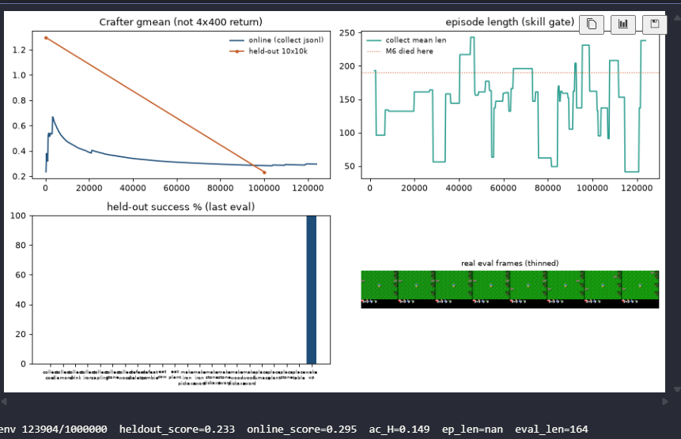

# Finding 14 — XL from scratch collapsed the actor by 20k env steps

**Status:** measured on M7 at ~100k / 1M, 2026-08-27 (run still going; do not grind it)  
**Kind:** negative result + recipe bug; not a 200M-vs-14.5 comparison  
**Evidence:** `results/m7_paper_online/{eval_metrics.json,train_metrics.json,collect_episodes.jsonl}`, notebook dashboard at ~124k

## Claim

Scaling the graph to ~200M and using 10k-step lives does **not** produce a paper-style climb if the actor dies first. On `configs/m7_paper_online.yaml` (XL WM **198M**, fresh actor, random WM), policy entropy sat on the **unimix floor** (~0.08 nats for 17 actions × `unimix=0.01`) inside the first **20k** env steps. Held-out gmean went **1.298 → 0.233**. Collect unlocks went from a random mix (sapling/wood/drink/plant/wake) to **wake_up only**. That is worse than random, not “too early to tell.”

`ep_len=nan` on the status line is **not** a crash. `collect_ep_len` is only written when a life finishes in that 16-step cycle, and the status reads the last *logged* row (`log_every=256`). 41/391 train rows have a length. Eval length **164** is the real number.

## Numbers

| window | `ac_entropy` mean | collect mean len | online gmean |
|---|---|---|---|
| 0–20k | 0.307 (min **0.081**) | 141 | 0.47 |
| 20–40k | **0.082** | 131 | 0.37 |
| 40–60k | 0.085 | 162 | 0.32 |
| 60–80k | 0.080 | 146 | 0.30 |
| 80–100k | 0.090 | 154 | 0.29 |

Held-out 10×10k STE (seed 100000):

| env_steps | gmean | mean len | mean ach | nonzero unlocks |
|---|---|---|---|---|
| 0 | **1.298** | 156 | 2.20 | drink 20, sapling 60, wood 20, plant 40, wake 80 |
| 100k | **0.233** | 164 | 1.00 | **wake 100, everything else 0** |

777 collect episodes to ~100k: mean length **163**, max **399**, zero ≥400. Last-200 unlocks: sapling 2%, wake 95%, wood 0%. Last `ac_entropy` 0.139 with `collect_entropy` **0.082** — imagination slightly less dead than the real policy; both are collapsed. M6’s 1M run never logged entropy below **0.223**.

World-model pixels are fine: `recon_l1` 0.34 → **0.011**. The WM is fitting the *collapsed* collect distribution (grass + sleep). That is not a reason to continue.

*Figure. Online gmean falling, length bouncing under the M6 190 line, held-out bars all zero except wake_up. Status `ep_len=nan` is a sparse log, not a NaN in the trainer.*

## Why this is not DreamerV3-from-scratch

`prefill_replay` is documented as 10k env steps. The loop **stops as soon as one finished episode is ≥ `seq_len` (32)**. Buffer only stores completed lives, so that is **one Crafter death (~160 steps)**, not 10k random. Actor-critic then updates against a random XL world model with `start_mode=all` (512 imagined starts of junk). Size-S M4/M5/M6 never did that: they inherited a 700k WM and an entropy-alive actor.

Do not read the falling blue gmean as “online score.” It is a cumulative geometric mean over a jsonl that is filling with wake-only deaths, so it **has** to fall once early random unlocks are diluted. The held-out bar chart is the skill check: they unlearned wood/sapling/drink.

## Failed alternative we are not running

Let this 1M finish because XL is 200M and “needs more steps.” After 80k env steps at the unimix floor, more data is more of the same sleep policy. Do not caption 0.23 vs 14.5. The follow-up recipe (`configs/m7_paper_online.yaml` → `m7_xl_paper`) keeps XL and matches the torch Crafter outer loop: 2500 random prefill, 100 WM pretrain, train_ratio 512, `imag_gradient=reinforce`. That is a new run, not a resume of these weights.

## Paper spin

Negative result: parameter count is not the missing piece once the actor is a delta on `unimix`. Limitations / recipe: a 10k prefill that exits after one episode is not the paper’s random seed; train the actor on a blank XL RSSM with `start_mode=all` and it can lock onto wake_up before the world model has seen Crafter.
