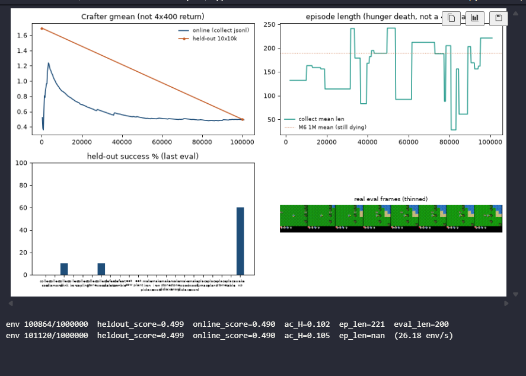

# Finding 16 — XL + M6 update count still collapses the actor by 20k

**Status:** measured on M7 v3 (`m7_xl_workstation`) at 100k / 1M, 2026-08-27  
**Kind:** negative result; prefill/pretrain/reinforce were not enough once `train_ratio` dropped to 32  
**Evidence:** `results/m7_xl_workstation/{eval_metrics.json,train_metrics.json,collect_episodes.jsonl}`, notebook dashboard at 100k

## Claim

Making the 1M finishable by cutting `train_ratio` 512 → 32 did **not** produce a healthy XL-from-scratch agent. It reproduced finding 14 on a faster clock. Policy entropy sat on the **unimix floor** (~0.08–0.10 nats) from **~20k** onward. Held-out gmean went **1.694 → 0.499**. The agent unlearned sapling/plant/table. Length bouncing under 190 is the same hunger death plus a sparse plot, not a new skill.

**26 env/s is the part that worked.** That is M6-class throughput. The next ~900k at this entropy is a sleep policy, not a 14.5 chase. Do not grind to 1M.

## Numbers

`ac_entropy` (train logs, `log_every=256`):

| window | mean | min | last |
|---|---|---|---|
| 0–20k | 0.465 | **0.080** | 0.190 |
| 20–40k | 0.141 | 0.082 | **0.082** |
| 40–100k | **0.085–0.089** | 0.082 | 0.096 |

First log with `ac_H < 0.12` is env **3584**. 322 / 391 train rows are under 0.10. Last 20 logs are 0.090–0.097. The screenshot **0.105** is a wiggle on the floor, not a recovery. M6’s 1M never logged below **0.223**.

Held-out 10×10k STE (seed 100000):

| env_steps | gmean | mean len | mean ach | nonzero unlocks |
|---|---|---|---|---|
| 0 | **1.694** | 158 | 2.6 | drink 30, sapling 50, wood 40, plant 50, table 10, wake 80 |
| 100k | **0.499** | 200 | 0.8 | drink 10, wood 10, **wake 60**, everything else 0 |

Return **−0.10** is again `mean_achievements − 0.9` (finding 11). Online gmean ~0.49 matches the 100k held-out. That agreement is “both are bad,” not a healthy curve.

Collect 602 lives to ~103k: window means **162–182**, min **13–34**, one life ≥400. Last-40 unlocks: wake 45%, wood 8%, drink 3%. World-model `recon_l1` 0.050 → **0.023** — it is fitting the collapsed collect distribution (finding 14).

*Figure. Online and held-out gmean falling together. Length is noisy; bars are mostly empty except wake. Status `ep_len=nan` is still a sparse log.*

## Contrast with the cancelled ratio-512 run

v2 (`m7_xl_paper`) at **40k** had `ac_H` **0.56** and a 30–35k collect window with wood **48%** / drink 24%. That was not floor entropy. It was also **~2 env/s / 5 days** (finding 15), so it was cancelled.

v3 kept the same seed recipe (2500 random prefill, 100 WM pretrain, `imag_gradient=reinforce`, XL) and only dropped the update count to M6’s 1+1. Entropy died anyway. Prefill+pretrain+reinforce do **not** substitute for the paper train ratio on this XL-from-scratch setup.

## Failed alternatives

- Keep going to 1M because 26 env/s is “finally fast.” The actor is already a unimix delta.
- Read length spikes to 240 / dips to 30 as learning. Mean is still ~170; min 13 is a real early death; the plot still forward-fills sparse `collect_ep_len`.
- Call 0.499 “better than v1’s 0.233” and treat it as progress. Both are worse than the random start. v1 was wake-only; this still has 10% drink/wood in n=10 — noise, not a tech tree.
- Silently restore `train_ratio` 512 on these weights. The actor is already collapsed.

## Paper spin

Negative result next to finding 14: XL-from-scratch on this RSSM collapses the discrete actor unless the outer loop is paper-heavy, and paper-heavy is a 5-day run on this box (finding 15). Workstation ratio 32 is finishable and dead. Do not caption either 100k number next to 14.5.
