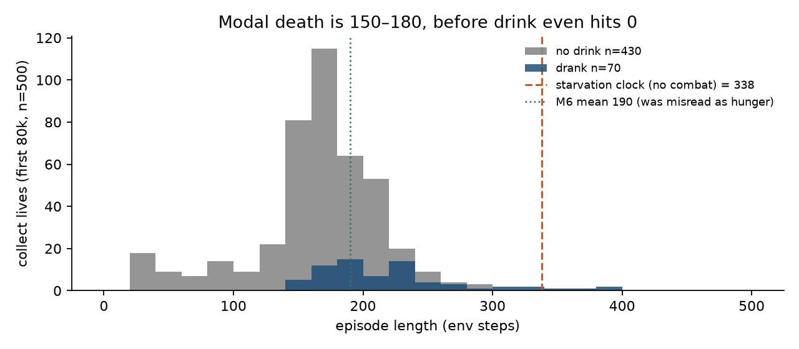
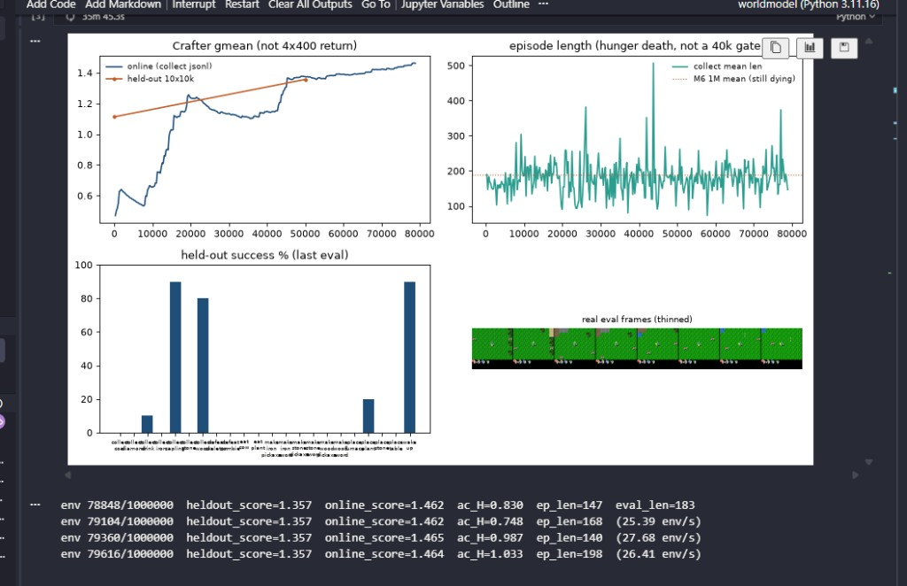

# Finding 19 — The ~200-step death is combat, not hunger and not a cap

**Status:** measured on M8-XL `m8_xl_acfix2` at ~80k env steps (500 collect lives), 2026-08-28  
**Kind:** Crafter mechanics vs dashboard folklore; not a DreamerV3 result  
**Evidence:** `results/m8_xl_acfix2/collect_episodes.jsonl`; Crafter `objects.py` life-stat / zombie code; exact no-combat clock

## Claim

Calling the 190-step Crafter wall “hunger death” is **false on this run**, and relabeling the length plot that way did not (and could not) move the curve. A player who never eats, never drinks, never sleeps, and never takes damage dies at step **338**, still at full health at step **200**. Two-thirds of our lives are already over by 220. That is **zombie (and sleep) damage**. The 10k cap is idle (max length 507).

This is not in DreamerV3. The paper never had to disambiguate “they die at 190” into a clock vs a mob.

## The clocks, from the env code (no combat)

Crafter (`crafter.objects.Player`): drink −1 every 21 awake steps, food −1 every 26, energy −1 every 31. Health only drops after a necessity hits 0 (`_recover < −15` → −1 health). Simulated with initial 9/9/9/9 and no hits:

| step | drink | food | energy | health |
|---|---|---|---|---|
| 150 | 2 | 4 | 5 | **9** |
| 180 | 1 | 3 | 4 | **9** |
| 189 | 0 | 2 | 3 | 9 |
| 200 | 0 | 2 | 3 | **9** |
| 338 | 0 | 0 | 0 | 0 (first starvation death) |

So any death whose length is in the **150–220 mode is not thirst**. Drink is still 1–2 and health would still be 9.

## What the 80k jsonl actually shows

500 lives, last `env_steps=80704`. Mean length **173**, median **172**, max **507**. 0% reach 1000. 66% die in 150–220. 38% die in 150–180 alone.

| slice | n | mean length | median |
|---|---|---|---|
| never `collect_drink` (86%) | 430 | 165 | 166 |
| drank | 70 | 225 | 208 |
| ate plant or cow (2.4%) | 12 | 208 | 178 |
| `defeat_zombie` (0.6%) | 3 | **313** | 232 |
| last 80 lives | 80 | 181 | 178 |

Drinking buys ~60 steps. It does **not** break the wall (drinkers still median 208). Almost nobody kills a zombie. Last 80 lives: wood 56%, sapling 65%, **wake_up 92.5%**, drink 24%, eat_cow 5%, defeat_zombie 1.2%.

A sleeping player takes **7** zombie damage per hit; awake takes **2**, cooldown 5 (`Zombie.update`). Nine health dies in one sleep-hit plus a follow-up, or about five awake hits. 92% of recent lives include a completed sleep. That is the mechanism that produces a 170-step corpse while the HUD still shows food and water.

*Figure. Grey = never drank. Navy = drank. Dashed line is the no-combat starvation death (338). The mass of the histogram is to the left of that line, and to the left of drink-empty (189).*

*Figure. Online gmean still climbing (~1.46), `ac_H` ~0.75–1.0 (not the unimix floor). Length sitting under 200 is not this run failing. Spikes to ~400–500 are the lives that were not adjacent to a zombie.*

## What we already ruled out

- **10k / 400 / “40k gate.”** Cap is 10000. One life hit 507. Truncation is not ending these episodes (`info['discount']` is death).
- **“Just wait, hunger will resolve if we train.”** M6’s finished 1M still sat at mean 190. Same wall, 12× more env steps.
- **Renaming the panel “hunger death.”** A caption is not a loss. Length did not move, because hunger was not the constraint.

## Do not do

- Add a hunger / thirst bonus, a drink-shaped reward, or a crop loss on the HUD hearts. That is the M3 extra-loss regime (findings 01, 04) applied to the actor.
- Raise `max_episode_steps`. It is already 10000 and idle.
- Kill this XL run because length is 180. `ac_H` is alive and gmean is up; watch **`defeat_zombie` and whether they sleep in the open**, not the 190 dotted line.

## Paper spin

A one-panel “Crafter death clocks” figure: starvation at 338 vs empirical length histogram vs zombie DPS. Useful to any reimplementation that treats mean episode length as a hunger proxy. Caption: length is a **combat** statistic until `defeat_zombie` is common; hunger is the *next* wall after that, around 330.
