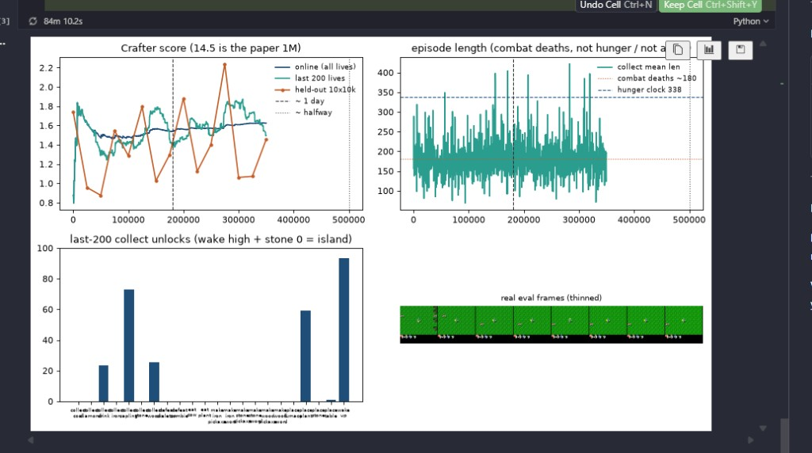

# Finding 28 — M16 350k: orange 2.2 was n=10 luck; wood still 24.5%; table never left ~1%

**Status:** measured on M16-XL `m16_xl_r512_acwarmup` at 351056 / 1M (2120 lives), 2026-09-05  
**Kind:** eval identifiability + negative on “warmup unlocks crafting by 350k”; not a dead trainer  
**Evidence:** `results/m16_xl_r512_acwarmup/collect_episodes.jsonl`, `eval_metrics.json`, `train_metrics.json`; finding 27 at 186k

## Claim

The dashboard drop after ~275k is **not collapse**. Held-out **2.24 at 275k → 1.06 / 1.07 / 1.45** is the same n=10 lottery as finding 13. That 2.24 bag had wood **70%**, drink **40%**, table **20%**. The next bag had wood **0%**. One extra unlock in ten lives is 10% and moves geometric mean a lot; it is not a tech-tree climb.

Last-200 collect **wood is still 24.5%** at 351k — the same number as finding 27 at 186k, vs M15’s **4%** at 136k. Warmup did **not** postpone finding 26 into a late wood-unlearn. What it also did **not** do is open crafting: last-200 **table 1%**, **stone 0**, **wood pickaxe 0**, **zombie 0**. Geometric mean of wake/sapling/plant/wood/drink saturates in **1.4–1.8**. Teal 1.83 at 300k → **1.49 at 350k** is plant 71%→59% plus drink 9.5%→24%, not wood vanishing.

Do not kill M16 because orange fell. Do not wait for teal to “recover” to 2.2 — 2.2 was never last-200. Leave it to the planned **500k** look. If table is still ~0 and wood still ≳15% there, warmup is a wood-hold, not a 14.5 recipe, and grinding to 1M is finding 25 again.

`ac_entropy` last window **0.44** (min **0.29**). `wm_recon_l1` **0.004**. Mean length **171**. ~1.67 env/s.

## Windows (collect)

| env | n | mean len | wake | sapling | plant | wood | drink | table | zombie | stone | last-200 gmean @ end |
|---|---|---|---|---|---|---|---|---|---|---|---|
| 0–25k (AC off) | 151 | 165 | 93 | 56 | 51 | **28.5** | 7.9 | 4.0 | 0 | 0 | — |
| 150–180k | 170 | 177 | 97 | 87 | 78 | 19.4 | 3.5 | **0** | 1.2 | 0 | 1.45 @ 175k |
| 180–200k | 110 | 181 | 97 | 92 | 80 | **30.0** | 17 | 0 | 0.9 | 0 | 1.46 @ 200k |
| 250–300k | 286 | 175 | 97 | 86 | 75 | **31.8** | 10 | **3.8** | 0.3 | 0 | **1.83** @ 300k |
| 300–350k | 283 | 176 | 95 | 76 | 64 | 27.2 | **22** | 1.4 | 0.4 | 0 | **1.49** @ 350k |
| last-200 | 200 | 171 | 94 | 73 | 59 | **24.5** | 24 | **1.0** | **0** | **0** | 1.49 |

Held-out n=10 after finding 27: 1.88 (200k, wood 60) → 1.12 → 1.40 → **2.24 (275k)** → **1.06 (300k, wood 0)** → 1.07 → **1.45 (350k, wood 40)**. Cumulative online gmean **1.62** is the saturated island line.

*Figure. Orange 2.2 is one lucky n=10 bag. Teal last-200 stays in the 1.4–1.8 band. Unlocks are wake / sapling / plant / wood / drink. Length sits on the combat wall (finding 19).*

## Failed alternatives

- Reading held-out 2.24 → 1.06 as actor collapse. `ac_entropy` min in that window is 0.29, not the 0.08 unimix floor.
- Killing M16 at 350k because teal is not 14.5. Wood held; that was the M16 hypothesis.
- Adding a table / stone / hunger bonus so gmean can leave 1.5. Findings 01, 05, 19.
- Grinding to 1M now because recon is 0.004. A good WM of the island stabilizes the island (finding 26).
- Waiting for last-200 gmean to recapture 2.2. Last-200 never was 2.2; 1.83 at 300k is the real peak so far.

## Paper spin

Results: a 25k actor delay can keep a third cheap +1 (wood) in the paper-ratio loop for **350k**, which M15 lost by 136k. Crafting (table) can still sit at ~1%. Held-out geometric mean on 10 lives is not a learning curve when the policy’s support is four saturated achievements plus a rare fifth.
