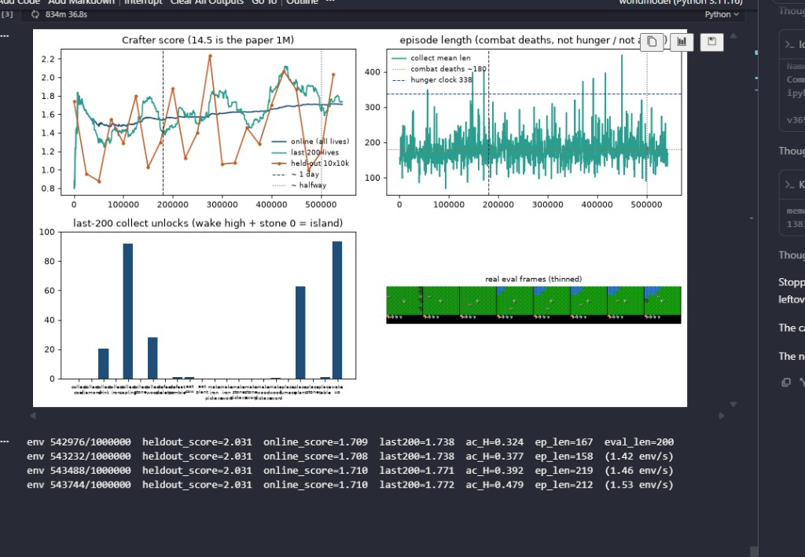

# Finding 30 — M16 544k: score is flat because stone is still 0; it will not walk to 14.5

**Status:** measured on M16-XL `m16_xl_r512_acwarmup` at 543744 / 1M (3206 lives), 2026-09-07  
**Kind:** planned 500k control after findings 28–29; negative on “halfway is when 14.5 starts”  
**Evidence:** `results/m16_xl_r512_acwarmup/collect_episodes.jsonl`, `eval_metrics.json`, `train_metrics.json`; dashboard `figures/m16_dashboard_544k.png`

## Claim

Crafter geometric mean is not a training-loss curve. It is a product over **22** achievement rates. Last-200 at 544k is **wake 93 / sapling 93 / plant 65 / wood 29 / drink 21 / table 1.5 / stone 0 / wood pickaxe 0 / zombie 1**. That set saturates in **1.6–2.1**. Online **1.71** and last-200 **1.78** at 544k are the same band as 186k (finding 27) and 462k (finding 29). Held-out **2.03 at 525k** is the n=10 lottery (wood 40 / table 20 / stone **0**).

It does **not** start climbing toward 14.5 at 500k, 750k, or 1M unless a **new achievement class** becomes common — first **stone**, then pickaxe / table as a chain, then iron. Finding 25 already ran the island to 826k at ratio 32: last-200 **fell**. Finding 29 said if table is still single-digit and stone is 0 at 500k, warmup is a wood-hold. That is this look. Do not grind the remaining ~456k hoping 1.8 slopes to 14.5.

Warmup still did its job vs M15: wood **held ~22–35%** for half a million paper-ratio steps (M15 was **4%** by 136k). That is the research result. It is not a 14.5 trajectory.

`ac_entropy` last log **0.43** (dashboard **0.48**). Unimix floor is ~0.08. Mean length **174**. ~1.53 env/s. Trainer is not collapsed.

## Last-200 ticks

| env | gmean | wood | drink | table | plant | zombie | stone | pick |
|---|---|---|---|---|---|---|---|---|
| 350k (finding 28) | 1.50 | 25.5 | 23.5 | 1.0 | 59 | 0 | 0 | 0 |
| 425k (finding 29 peak) | **2.08** | **35.0** | 34.5 | 4.0 | 70 | 1.5 | 0 | 1.0 |
| 462k | 1.88 | 21.5 | 22.5 | 3.5 | 69 | 1.0 | 0 | 0.5 |
| 500k | 1.63 | 22.5 | 18.5 | 1.0 | 60 | 1.5 | 0 | 0 |
| 525k | 1.73 | 27.5 | 22.0 | 1.5 | 48 | 1.0 | 0 | 0 |
| 544k live | **1.78** | **29.0** | 21.0 | **1.5** | 65 | 1.0 | **0** | **0** |

Held-out n=10 after finding 29: **0.997 (475k)** → 1.19 (500k) → **2.03 (525k, wood 40 / table 20 / stone 0)**. Same lottery.

*Figure. Blue/teal sit in 1.7–1.8 past the 500k “halfway” line. Orange 2.03 is ten lives. Unlocks are the cheap +1s. Length sits on the combat wall (finding 19). The y-axis of the score panel maxes at 2.2; 14.5 is not on that scale.*

## Failed alternatives

- Waiting for 600k / 750k / 1M because “the paper climbs late.” Without stone the geometric mean has no remaining degrees of freedom.
- Reading held-out 2.03 as the start of the climb. The previous bag was **1.00**.
- Reading wood 29% as leaving the island. Stone is still 0; table is back to **1.5%** (the 4% at 462k did not stick).
- Adding a stone / table / hunger bonus so the line can move (findings 01, 05, 19).
- Finishing 1M so 1.7 can sit next to 14.5 (finding 20). A complete 1M wood-hold is optional archive, not a score chase.

## Paper spin

Results: delaying the actor 25k on `train_ratio` 512 **holds wood** through 544k and still **never opens stone**. Geometric mean then looks “stuck at 2 for half a million steps” even while the trainer is healthy. The 14.5 number is a late-tree number; this run is a mid-tree occupancy result.
