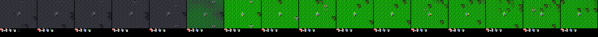

# Finding 37 — M17 500k: the trainer is live; 2951 lives never mined stone; paper knobs are not 14.5

**Status:** measured on M17-XL `m17_xl_paper` at 512160 / 1M (2951 lives), 2026-09-13  
**Kind:** planned halfway control; negative on “Table B.1 + train_ratio 512 walks to 14.5 on this graph”  
**Evidence:** `results/m17_xl_paper/collect_episodes.jsonl`, `eval_metrics.json`, `train_metrics.json`; `imagine_step_500000.png`; `ckpt_step_500000.pt`

## Claim

Halfway looks flat because **the achievement set is flat**, not because training stopped. `wm_steps` / `ac_steps` **500068** at env **499968**. `wm_recon_l1` **0.0046**. Reward MAE **0.0029**. `ac_H` **0.17** (min **0.15**) — above the ~0.08 unimix floor, drifting down as the island hardens. Collect entropy sits on **0.079** (greedy in the env). Mean length **179**. Max length **440**. Stone **0 / 2951**. Last-200 gmean **1.61**. Cumulative online **1.75**.

That is a working world model of a sleep–plant–die policy. Imagination at 500k is still Crafter (night→day, HUD, player). Geometric mean over 22 achievements cannot leave ~1.6–2.0 while 18 of them stay at 0%. Paper seq 64 / GRU 4096 / replay 1e6 / `train_ratio` 512 / `blocks=2` / actor-from-0 **held wood** (~25–35%) vs M15’s 4% and **did not** open stone. The 500k look is the experiment. Do not grind the remaining 500k hoping 1.61 becomes 14.5.

Held-out **2.08 (475k, wood 50 / table 10) → 1.09 (500k, wood 0)**. Finding 13 lottery.

## Last-200 / windows

| env | last-200 gmean | wood | table | drink | zombie | stone | `ac_H` |
|---|---|---|---|---|---|---|---|
| 200k (finding 33) | 1.82 | 34 | 4 | ~10 | 0 | **0** | 0.19 |
| 318k (finding 34) | 2.10 | 39 | 7.5 | 15 | 0.5 | **0** | 0.18 |
| 400k (finding 36) | 1.60 | 21 | 1 | 7 | 0 | **0** | 0.19 |
| **500k** | **1.61** | **27** | **2** | 6.5 | 1 | **0** | **0.17** |

| env window | n | mean len | wake | sapling | plant | wood | table | stone |
|---|---|---|---|---|---|---|---|---|
| 0–100k | 614 | 177 | 96 | 79 | 65 | 33 | 3.9 | 0 |
| 100–200k | 569 | 178 | 97 | 91 | 79 | 36 | 3.7 | 0 |
| 200–300k | 562 | 178 | 98 | 96 | 85 | 33 | 3.4 | 0 |
| 300–400k | 573 | 174 | 96 | 93 | 82 | 27 | 2.8 | 0 |
| 400–500k | 561 | 178 | 96 | 96 | 82 | 27 | 2.1 | 0 |
| last-200 | 200 | 179 | 98 | 96 | 87 | 25 | 2.5 | **0** |

*Figure. 15-step `z_prior` at 500k. Night→day, HUD, player. The world model is not frozen. The policy this prior was rolled from stands in grass.*

## What this is not

- **A dead optimizer.** Recon, KL, and 500k actor-critic updates moved. Finding 14 collapse is wake-only + `ac_H` glued to 0.08.
- **A missing recon head.** `recon_l1` 0.004. Findings 01, 05.
- **Hunger.** Length 179 vs starvation 338 (finding 19). `defeat_zombie` 0.2% over the whole run.
- **Orange-line collapse.** 500k held-out wood 0 is ten lives.

## Failed alternatives

- Grinding M17 to 1M so 1.61 can sit next to 14.5.
- Adding a stone / zombie / hunger bonus. Findings 01, 05, 19.
- Raising `entropy_scale` on these weights. The actor is already a peaked sleep policy; a bigger entropy term on island replay is not the paper’s 14.5 recipe.
- Loading `ckpt_step_500000.pt` into a new yaml and calling it a fresh experiment.

## Paper spin

Results: the leftover Table B.1 knobs on 16 GiB (finding 31) reproduce a **wood-hold island** at the paper replay rate, not the published 14.5 tree. Halfway is the right stop. The next question is why this actor never puts a mining life in replay (`collect_stone` 0 in 2951 lives), not whether recon needs another 500k.
